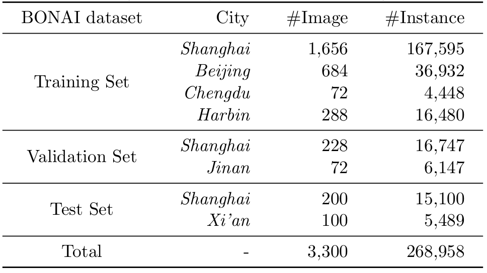

# BONAI

BONAI (**B**uildings in **O**ff-**N**adir **A**erial **I**mages) is a dataset for building footprint extraction (BFE) in off-nadir aerial images.

[[Paper]]() [[Dataset]](https://drive.google.com/drive/folders/171PPLyEoIa67ZCuO8GSbnRJWreO-K0ac?usp=sharing)

  

## Description

BONAI contains 268,958 building instances across 3,300 aerial images with fully annotated instance-level roof and footprint for each building as well as the corresponding offset vector. Compared to BONAI, existing BFE datasets only annotate building footprints.

The images of BONAI are taken from six representative cities of China, i.e., Shanghai, Beijing, Harbin, Jinan, Chengdu, and Xi'an, the detailed number of images and object instances per image set and city are reported in the below table.

  

## Download

You can download the dataset on [Google Driver](https://drive.google.com/drive/folders/171PPLyEoIa67ZCuO8GSbnRJWreO-K0ac?usp=sharing).

## Evaluation
Training, Validation and Testing sets are publicly available. The evaluation codes will be upload soon.

## Contact

This repo is currently maintained by Jinwang Wang (jwwangchn@whu.edu.cn).